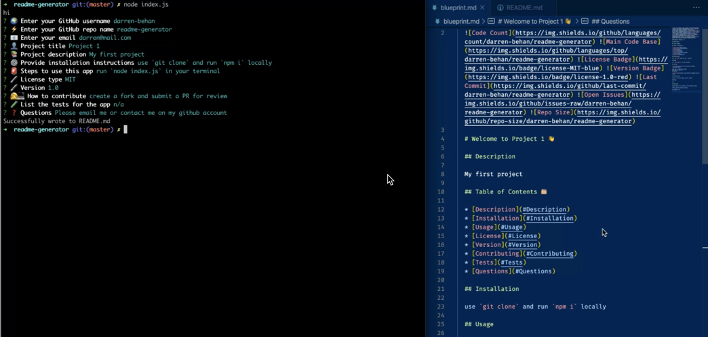

        

  # Welcome to README Generator 👋

  ## Description

  📚 This app generates a README.md file through a series of user prompts in the command line. It is powered by node.js & ES6+. View `blueprint.md` for sample content contained in a `README.md`

  ## Table of Contents 🗂

  * [Description](#Description)
  * [Installation](#Installation)
  * [Usage](#Usage)
  * [License](#License)
  * [Version](#Version)
  * [Contributing](#Contributing)
  * [Tests](#Tests)
  * [Questions](#Questions)

  ## Installation

  ⚙️ use `Clone with HTTPS` and run `git clone + the HTTPS link` to install locally. Then, run `npm i`

  ## Usage

  🚨 run `node index.js` in the terminal, answer the prompts and a file called `blueprint.md` will generate containing the information required for your `README.md` file

  View live demo <a href="https://drive.google.com/file/d/1cVIweJ_w4y9fEC4dc8TGAjuIwE_CrJGn/view">here</a>

  

  ## License

  🖋 

  This app is not using a license

  ## Version

  ℣ 

  ## Contributing

  👩‍💻 create a fork and submit a PR for review

  ## Tests

  🧪 n/a

  ## Questions

  ❓ Feel free to create an issue for review

  🌍 https://github.com/darren-behan/readme-generator

  📧 me at darrenbehan@hotmail.com

  